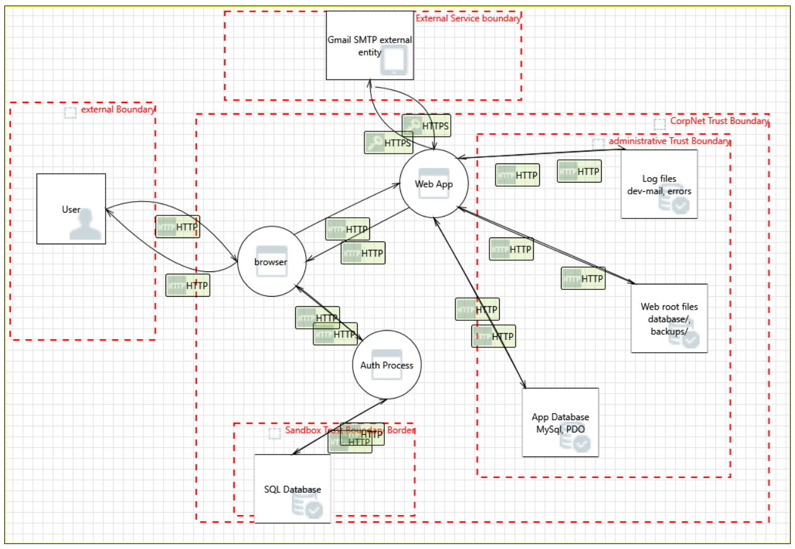

# Local Traffic Alert — Security Risk Assessment Report

**Methodology:** Manual, code-first threat model (STRIDE), following the same 8‑phase
approach as the `threat-modeling` skill (project understanding → data flow →
trust boundaries → design review → STRIDE → risk validation → mitigation →
report). This pass was done by direct source review — the automated
Ghidra/CodeQL/Joern/Luoshu tool integrations.
**Target:** `local-traffic-alert`  · **Date:** 2026‑07‑20
**Stack:** PHP 8.x, MySQL/MariaDB, Apache/XAMPP, vanilla JS + Bootstrap 5

---

## 1. Executive Summary

Local Traffic Alert is a ~150‑file PHP monolith (community traffic reporting,
congestion mapping, digital fines/payments, emergency routing) with four
roles: Super Admin, Admin, Police, User. Overall the codebase shows a
security‑conscious author — PDO prepared statements are used consistently,
passwords are bcrypt‑hashed with a real complexity policy, CSRF tokens guard
every state‑changing AJAX call sampled, uploads are extension+MIME checked
with randomized filenames, and fine/payment queries are consistently scoped
by `user_id`. **No SQL injection, RCE, or LFI was found in the code paths
reviewed.**


1. **A real Gmail address and app password are committed in `.env` and
   `config/email-credentials.php`.**
2. **The shipped `.env` has `APP_ENV=production` but `APP_URL` still points
   at `localhost`** — which is exactly the condition that makes the app
   write OTP codes and password‑reset links/tokens in plaintext to a
   world‑readable log file (`logs/dev-mail.log`) sitting inside the web
   root with no access control. This log already contains a real OTP and
   reset token from a prior run.
3. **Brute‑force protection is scaffolded but never enforced** — the
   `login_attempts` counter, `MAX_LOGIN_ATTEMPTS`/`LOCKOUT_TIME` constants,
   and a `blocked_ips` table all exist, but nothing in `auth/login.php`
   actually checks them, so login and OTP endpoints accept unlimited
   attempts.

Fixing #1 and #2 is urgent — do that first, today, regardless of anything
else in this report.

---

## 2. System Overview

| | |
|---|---|
| Roles | `1` Super Admin · `2` Admin · `3` Police · `4` User (see `config/constants.php`) |
| Entry surfaces | Public pages (home/FAQ/map preview, no auth) · `auth/*` · `user/*` · `police/*` · `admin/*` · `ajax/*` (20+ JSON endpoints) · `api/v1/*` · `cron/recompute-congestion.php` (CLI only) |
| Data store | MySQL — 19 tables incl. `users`, `traffic_reports`, `fines`, `payments`, `emergency_routes`, `signal_timings`, `audit_logs`, `blocked_ips` (schema: `database/schema.sql`, 688 lines) |
| External deps | Gmail SMTP (via PHPMailer, vendored), simulated payment gateway (SSLCommerz/bKash/Stripe *placeholders*, no live integration yet) |
| Session | Native PHP session, `HttpOnly` + `SameSite=Strict`, **`secure` flag hardcoded false** |

### Data flow (condensed)
```
Internet ──▶ Apache/.htaccess ──▶ index.php / auth,user,police,admin,ajax,api
                                        │
                        ┌───────────────┼────────────────┐
                        ▼               ▼                ▼
                  MySQL (PDO,      Gmail SMTP        assets/uploads/
                  prepared stmts)  (PHPMailer)        (reports, avatars)
                        │
                        ▼ (fallback on SMTP failure, gated by APP_URL check)
                  logs/dev-mail.log   ◀── unprotected, in web root
```
<p align="center">

</p>
### Trust boundaries
- **TB1 — Anonymous → Authenticated**: crossed at `auth/login.php`,
  `auth/register.php`. Guarded by CSRF + bcrypt password verify.
- **TB2 — User → Police/Admin**: role checked via session `role_id`
  (`requireRole()`), *not* re-validated against the DB per request (see M2).
- **TB3 — App → Database**: PDO with `ATTR_EMULATE_PREPARES => false`,
  parameterized everywhere reviewed.
- **TB4 — App → External SMTP**: real internet-facing dependency; credential
  leak here (C1) has consequences outside the app itself.
- **TB5 — CLI/cron → App (HTTP)**: `ajax/congestion/recompute.php` accepts
  either an authenticated admin session *or* a shared `CRON_SECRET`.
- **TB6 — Filesystem → Web**: everything under the document root is a
  potential trust-boundary crossing if the web server config doesn't
  actually enforce the app's `.htaccess` rules (see H2).

---

## 3. Findings

Severity follows a standard qualitative CVSS-like scale (Critical/High/Medium/Low).
File:line references point at the uploaded snapshot.

### 🔴 C1 — Live SMTP credentials committed to the repo
**CWE-798 (Hard-coded Credentials)** · `.env:14-15`, `config/email-credentials.php:11-12`

```
MAIL_USERNAME=abusufian.cyse@gmail.com
MAIL_PASSWORD=oqmw puei yczx hpja
```
This is a real Gmail address with what is formatted exactly like a live
16‑character Google App Password, sitting in a file that was included in
the archive you shared. Anyone with this file can send mail as that account
(and, depending on account settings, potentially access other Gmail‑linked
services).

**Fix — do this now:**
1. Go to the Google Account → Security → App Passwords for
   `abusufian.cyse@gmail.com` and **revoke this app password immediately.**
2. Rotate `MAIL_PASSWORD` to a newly generated app password, store it only
   in the untracked `.env` (or better, a secrets manager / host-level env
   var), never in a file that ships in an archive or gets committed.
3. Add `.env` and `config/email-credentials.php` to `.gitignore` if not
   already, and scrub them from git history (`git filter-repo` /
   BFG) if this was ever pushed to a remote.

### 🔴 C2 — OTPs and password-reset tokens leak via an unprotected log file
**CWE-532 (Insertion of Sensitive Info into Log File) + CWE-284 (Improper Access Control)**
`includes/helpers.php:20-47` (`sendEmail()`), `logs/dev-mail.log`

`sendEmail()` falls back to writing the **full plaintext email body**
(including 6-digit OTPs and password-reset links with tokens) to
`logs/dev-mail.log` whenever real SMTP sending fails **and** `APP_URL`
contains `localhost`/`127.0.0.1`. The fallback exists to keep local dev
usable without SMTP — a defensible idea — but two things make it dangerous
here:

- The shipped `.env` sets `APP_ENV=production` yet leaves
  `APP_URL=http://localhost/local-traffic-alert/` — so a real deployment
  running with this exact `.env` **will** take the dev-mail fallback path
  on any SMTP hiccup.
- `logs/` has **no `.htaccess`** (unlike `assets/uploads/`, which correctly
  has one). If the app is ever reachable at that URL, `logs/dev-mail.log`
  and `logs/errors/error.log` are just static files Apache will serve.

The log already on disk contains a real OTP (`612496`) and a real
verification token from a previous test run — proof this path executes.

**Impact:** anyone who can fetch `/logs/dev-mail.log` can read any user's
current email-verification OTP or password-reset token and take over their
account, no credentials needed.

**Fix:**
1. Add `logs/.htaccess` mirroring `assets/uploads/.htaccess` (deny all, or
   at minimum deny the log file extensions), and move `logs/` outside the
   web root entirely if your hosting allows it — that's the real fix,
   `.htaccess` is a backstop, not a plan.
2. Before deploying, set `APP_URL` to the real production domain (not
   `localhost`) so the dev-mail fallback can never trigger in prod — the
   code's own `$isLocalDev` check depends on this being correct.
3. Never write OTPs/tokens to any log, dev or otherwise — log "OTP sent to
   user 123" instead of the OTP value itself.

### 🔴 C3 — No enforced brute-force / account-lockout protection
**CWE-307 (Improper Restriction of Excessive Authentication Attempts)**
`auth/login.php:139-143`, `includes/auth.php:159-169` (`recordLoginAttempt`)

`recordLoginAttempt()` increments `users.login_attempts` on every failed
login, and `config/config.php` defines `MAX_LOGIN_ATTEMPTS = 5` and
`LOCKOUT_TIME = 900`. **Nothing reads `login_attempts` back to block a
login.** The schema even has a `blocked_ips` table that's defined but never
referenced anywhere in the codebase (`grep -r blocked_ips` returns nothing
outside `schema.sql`). Same story for `verifyEmailOtp()` /
`verifyPasswordResetOtp()` — no attempt counter at all, just a 10-minute
expiry on a 6-digit code (see M1).

**Impact:** unlimited password guessing against `auth/login.php`, and
unlimited OTP guessing within the 10-minute window (1,000,000 possible
6‑digit codes with no throttle).

**Fix:** In the failed-login branch of `login.php`, check
`login_attempts >= MAX_LOGIN_ATTEMPTS` and `last_attempt` against
`LOCKOUT_TIME` before calling `verifyPassword()`; reject with a generic
"too many attempts, try again later" if locked out. Add the same counter +
lockout to `verifyEmailOtp()`/`verifyPasswordResetOtp()`. Either wire up
`blocked_ips` for repeated abuse across accounts, or drop the unused table.

### 🟠 H1 — Session cookie `secure` flag hardcoded to `false`
**CWE-614 (Sensitive Cookie Without Secure Flag)** · `config/session.php:11-19,29-37`

```php
session_set_cookie_params([
    ...
    'secure' => false,   // <-- always false, regardless of environment
```
Even on a fully HTTPS deployment, the session cookie will still be marked
non-secure, meaning a browser will happily send it over a plaintext HTTP
connection if one is ever available (mixed content, HTTP fallback, a
misconfigured redirect) — enabling session hijacking via network
interception.

**Fix:** `'secure' => (APP_ENV === 'production')` or, better,
`'secure' => !empty($_SERVER['HTTPS'])`, and enforce HTTPS-only in
production regardless.

### 🟠 H2 — Sensitive directories have no access control beyond a single `.htaccess`, and none at all in several cases
**CWE-552 (Files/Directories Accessible to External Parties)**

The root `.htaccess` blocks `config.php`, `database.php`, `constants.php`
by filename, and `assets/uploads/.htaccess` blocks script execution. But:
- `database/` (contains `schema.sql` and migration files — full DB
  structure), `backups/` (`database/`, `system/`, `uploads/`
  subdirectories), and `logs/` (see C2) have **no `.htaccess` at all**.
- All of this protection is Apache-specific (`.htaccess` + `mod_rewrite`).
  It silently does nothing on Nginx, and does nothing on Apache if the
  vhost sets `AllowOverride None` (a common hardening default) — there's
  no defense-in-depth (e.g., these directories aren't even outside the web
  root, which would make the question moot).

**Fix:** Move `database/`, `backups/`, and `logs/` outside the document
root (the only fix that works regardless of web server / `.htaccess`
config). If they must stay inside it, add `Require all denied` /
`deny from all` `.htaccess` files to each **and** verify (don't just
assume) that `AllowOverride` is actually enabled for this vhost.

### 🟠 H3 — Shared cron secret accepted over GET, with a weak hardcoded default
**CWE-798 + CWE-598 (Info Exposure Through Query Strings)**
`config/constants.php:161-163`, `ajax/congestion/recompute.php:28-29`

```php
define('CRON_SECRET', getenv('LTA_CRON_SECRET') ?: 'change-me-please-set-LTA_CRON_SECRET');
...
$providedSecret = $input['cron_secret'] ?? $_GET['cron_secret'] ?? '';
```
Two compounding issues: the secret has a hardcoded, guessable fallback if
`LTA_CRON_SECRET` isn't set in the environment, and the endpoint accepts it
as a **GET query parameter**, which ends up in access logs, browser
history, and `Referer` headers.

**Fix:** Remove the GET fallback (POST body / header only); fail hard (refuse
to run, don't silently use the default) if `LTA_CRON_SECRET` isn't set in a
production environment, rather than falling back to a known string.

### 🟡 M1 — OTP verification has no request-level rate limiting
**CWE-307** · `includes/auth.php:211-236, 280-301`

Covered partly by C3, called out separately because it's a distinct code
path: `verifyEmailOtp()` / `verifyPasswordResetOtp()` rely solely on a
10‑minute expiry, not an attempt counter. Add a `verification_otp_attempts`
counter (mirroring `login_attempts`) and lock after a small number of
wrong guesses per code.

### 🟡 M2 — Role is cached in session, not re-checked per request
**CWE-613** · `includes/functions.php:92-104`

`getCurrentUserRole()` reads `$_SESSION['role_id']`, set once at login.
If an admin demotes a user or an officer's account is deactivated
mid-session, that user keeps their old access level until they log out or
the session naturally expires (`SESSION_LIFETIME = 7200`, 2 hours).
Acceptable for many apps, but worth a deliberate decision given this app
governs fine issuance and emergency routing. If tighter revocation matters,
re-check `is_active`/`role_id` from the DB periodically (e.g. once per
session refresh) rather than trusting the session forever.

### 🟡 M3 — `backups/` directories exist inside the web root
**CWE-538** · `backups/database/`, `backups/system/`, `backups/uploads/`

Empty in this snapshot, but their presence inside the document root means
any future backup job that writes here creates an instantly web-reachable
dump of the database (see H2 for why `.htaccess` alone isn't sufficient
protection). Move backup output outside the web root as a standing rule,
not just for this one directory.

### 🔵 L1 — Payment flow is fully simulated; needs webhook-signature verification before going live
`ajax/payments/pay.php:1-11,60-90`

Correctly self-documented as a demo ("no live gateway credentials"). Fine
for now — ownership checks (`WHERE id = ? AND user_id = ?`), CSRF, and
transactional DB writes are all in place. When real SSLCommerz/bKash/Stripe
integration lands: verify the gateway's webhook signature server-side, and
never trust a client-supplied "payment succeeded" call the way a demo
naturally does — confirm status via a server-to-server callback.

### 🔵 L2 — Baseline security headers present, but incomplete
`.htaccess:7-9`

`X-Frame-Options: DENY` and `X-Content-Type-Options: nosniff` are set.
No `Content-Security-Policy`, `Strict-Transport-Security`, or
`Referrer-Policy`. Worth adding once HTTPS is confirmed in production
(HSTS in particular should only ship once HTTPS is guaranteed).

### 🔵 L3 — Historical debug/fix scripts are explicitly blocklisted by name
`.htaccess:20`

The root `.htaccess` denies access to files like `debug-dashboard.php`,
`fix-password.php`, `db-test.php`, `verify-specific-users.php`, etc. None
of these exist in the current snapshot, but the fact they're named
suggests throwaway debug/admin scripts have lived in the web root during
development before. Treat the blocklist as a smell, not a control — the
underlying practice (writing ad-hoc admin/debug PHP files directly into
the public docroot) is the thing to stop doing, since it only takes one
forgotten file to reopen this.

---

## 4. STRIDE Summary

| Category | Relevant finding(s) |
|---|---|
| **S**poofing | C3 (unlimited login/OTP guessing), H3 (guessable cron secret) |
| **T**ampering | H1 (session hijack via non-secure cookie) |
| **R**epudiation | *(not tested — `audit_logs`/`logActivity()` exist and are called consistently in sampled files; worth a dedicated pass)* |
| **I**nformation Disclosure | C1 (leaked SMTP creds), C2 (OTP/token log exposure), H2/M3 (DB schema, backups, logs in web root) |
| **D**enial of Service | H3 (unauthenticated recompute trigger if default secret unchanged — low impact, just recompute load) |
| **E**levation of Privilege | M2 (stale session role after demotion) |

---

## 5. Risk Priority Table

| ID | Finding | Severity | Effort to fix |
|---|---|---|---|
| C1 | Live Gmail credentials committed | 🔴 Critical | Minutes (rotate) |
| C2 | OTP/token leakage via unprotected log | 🔴 Critical | Low (add `.htaccess` + fix `APP_URL`) |
| C3 | No enforced login/OTP lockout | 🔴 Critical | Low–Medium |
| H1 | Session cookie not `secure` | 🟠 High | Minutes |
| H2 | `database/`/`backups/`/`logs/` unprotected | 🟠 High | Low |
| H3 | Cron secret via GET + weak default | 🟠 High | Minutes |
| M1 | No OTP rate limiting | 🟡 Medium | Low |
| M2 | Session role not re-validated | 🟡 Medium | Medium |
| M3 | `backups/` inside web root | 🟡 Medium | Low |
| L1 | Payment webhook verification (future) | 🔵 Low | N/A yet |
| L2 | Missing CSP/HSTS/Referrer-Policy | 🔵 Low | Low |
| L3 | Blocklisted debug scripts (process smell) | 🔵 Low | Process fix |

---

## 6. What's already done well

Worth stating explicitly, since a threat model can otherwise read as
all-negative:

- **SQL injection:** not found. PDO + prepared statements throughout;
  the one dynamic-column-name case (`ajax/system/signals.php`) is
  correctly guarded by a strict allowlist before interpolation.
- **Passwords:** bcrypt (`cost=12`), `password_verify()`, real server-side
  complexity policy (length + upper/lower/digit/special).
- **CSRF:** `random_bytes(32)` tokens, `hash_equals()` comparison, checked
  on every mutating AJAX endpoint sampled.
- **File uploads:** extension allowlist + `finfo` MIME sniffing + size cap
  + randomized filenames + an upload-directory `.htaccess` that explicitly
  denies execution of script extensions. This is genuinely solid.
- **IDOR:** fines/payments consistently scope by `user_id` in the `WHERE`
  clause, not just in the UI.
- **OTP/reset secrets:** stored as bcrypt hashes, not plaintext, with
  expiries — the leak in C2 is about logging the *raw* value in transit,
  not about how it's stored.

---

## 7. Suggested remediation order

1. Rotate the Gmail app password and scrub it from any history (C1) — today.
2. Fix `logs/` access control and correct `APP_URL` for production (C2) — today.
3. Implement login/OTP lockout using the constants/columns that already
   exist (C3).
4. Fix the session cookie `secure` flag (H1) and cron-secret handling (H3) —
   both are quick.
5. Move `database/`, `backups/`, `logs/` outside the web root (H2, M3).
6. Add OTP attempt limiting (M1), decide on session/role revalidation
   policy (M2), and layer in CSP/HSTS once HTTPS is confirmed (L2).

---

*Scope note: this review covered the areas most likely to carry risk —
auth, session, CSRF, SQL usage, file upload, payments/fines ownership
checks, and secrets/config handling — via targeted manual reading of
~25 of the ~150 PHP files plus the schema. It is not an exhaustive
line-by-line audit of all 150 files (e.g. `police/`, `api/v1/*`, and the
admin congestion/signal UIs beyond what's cited above weren't individually
reviewed).*
